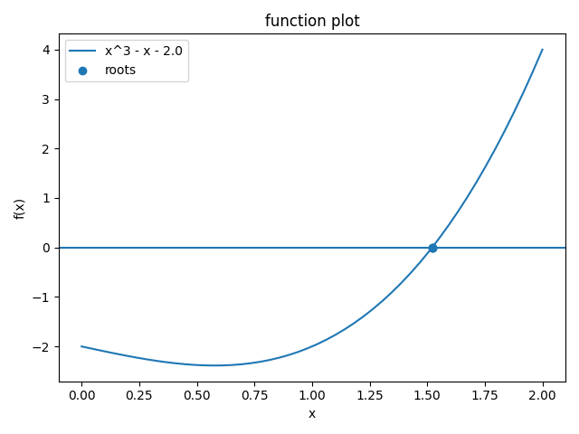

# Numerical Workbench
A Python toolkit for numerical methods including root finding, integration, and function visualization.

## Description
This project implements a numerical computation toolkit in Python using an object-oriented design.

It supports:
- Root-finding algorithms (Bisection, Newton, Secant)
- Numerical differentiation and integration
- Function parsing from strings
- Visualization of functions and convergence
- Command-line interface (CLI)

---

## Features

### Root Finding
- Bisection method
- Newton method
- Secant method

### Calculus
- Central difference derivative approximation
- Trapezoidal rule integration
- Simpson’s rule integration

### Utilities
- Expression parsing (safe evaluation)
- Polynomial class with full operations
- Plotting of:
  - Functions
  - Convergence of methods

### CLI
Run computations directly from terminal.

---

## Project Structure
final-project/
│── src/
│ └── numerical_workbench/
│ ├── functions.py
│ ├── solvers.py
│ ├── plotting.py
│ └──workflow.py
│
│── tests/
│── README.md
│── setup.py
│── environment.yml


---

## Installation

```bash
pip install -e .

---
## Example

Solving the equation:

f(x) = x^3 - x - 2

Using Newton’s method:

```bash
python -m numerical_workbench.cli solve-root \
  --function-kind polynomial \
  --expression "x^3 - x - 2" \
  --method newton \
  --interval 1:2
```

Output:

- Root ≈ 1.52138



## Testing
pytest -v
